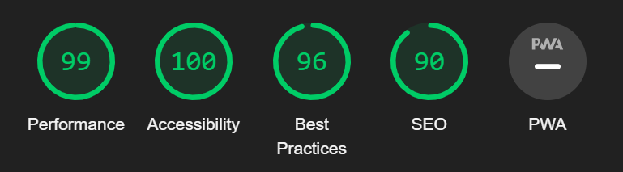

# Sports Quiz 

This is a quiz website for people who want are intrerested in sports and want to challenge themselves to a fun interactive quiz. The question come from a varity of sports like basketball, football, gymnastics, track and many more. It also has a timer and a score system to add more stakes and enjoyment in the website.

## Features

This section goes over the different parts of this project. An explanation will be given of what the features provide the user.

### Exisiting Features
- __Introduction__
  
  -This section is an small introduction to the quiz.

  -It describes:
  
  - what the quiz is about.

  - How long it should take to complete.

  - And who made it.

   

- __Questions__

  -This part produces the questions that have to be answered in the quiz.

  -It has a total of 10 questions.

  - __Images__

    -Each question has a image with it.

    -The image is there to help the user get a visual understanding of the question if the words alone cannot help.

 

  - __Answers__

    -This part is where the answers to the question given are.

    -The user is given 4 different answers, with only 1 of them being the right answer.

    -When a user clicks on a answer the text will either turn red or green.

    -If the text turns red that is a sign of an incorrect answer.

    -If the text turns Green that is a sign of an correct answer.

  - __Next__

    -The next button is used to move through the quiz.

    -This button only pops up when an answer is picked.

  - __Countdown__
  
    -The Countdown is used to give the user a challenge while taking the quiz.

    -The countdown automatically starts when the page is loaded.

    -When the time reaches zero, the quiz ends and the users score is shown, regardless if they have finished all 10 questions or not.

## Testing

 - I tested to see if the website would work on Google Chrome, Microsoft Edge and Firefox.

 - The website was able to function as intended and that the it was responsive.

 - The Questions all loaded in the correct position with the correct picture.

 - When an answer was clicked on the website was able to determine if it was correct or incorrect by highlighting the wrong answer in red (if it was wrong) and the right answer in green.

 - After an answer is clicked, the next button pops up on time and response correctly by showing the next question.

 - When the timer reaches zero the it instantly shows the score and correctly tallys up the correct answers.

### Validator Testing

- HTML

  - No errors were found when passing through the official [(Jigsaw) validator](https://validator.w3.org/).
  
- CSS

  - No errors were found when passing through the official [(Jigsaw) validator](https://jigsaw.w3.org/css-validator/validator).

- JavaScript

  - The JavaScript was passed through [JSHint.com](https://jshint.com/) where it detected 26 warnings and 4 undefined variables.

- Accessibility

  - I can confirm that the colors and fonts are easy to read and accesible by running it through lighthouse in devtools.

  

## Deployment

- The site was deployed to GitHub pages. The steps to deploy are as follows: 
  - In the GitHub repository, navigate to the Settings tab 
  - From the source section drop-down menu, select the Master Branch
  - Once the master branch has been selected, the page will be automatically refreshed with a detailed ribbon display to indicate the successful deployment. 

[View live project here](https://uloe-g.github.io/sportsquiz/).

## Credits

### Content

- The video used to help me create the quiz was from [here](https://www.youtube.com/watch?v=PBcqGxrr9g8&t=1825s).

- The video used to help me create a timer was found [here](https://www.youtube.com/watch?v=x7WJEmxNlEs&t=1s).

- The video used to help me stop the timer was found [here](https://www.youtube.com/watch?v=JRevaOwNKTI).

### Media
- The angry emoji was taken from [Adobe Stock](https://stock.adobe.com/search?k=angry+emoji).

- The background image was found on [Adobe Stock](https://stock.adobe.com/ie/search?k=multi+sports&search_type=usertyped&asset_id=475081166).

- The thumbs down emoji was found on [Adobe Stock](https://stock.adobe.com/search/images?k=thumbs+down+emoji).

- The Stanley Cup was found on [Wikipedia](https://en.wikipedia.org/wiki/Stanley_Cup).

- The Wimbeldon logo wad found on [Wikipedia](https://en.wikipedia.org/wiki/Wimbledon_Championships).

- The WWE logo was found on [Wikipedia](https://en.wikipedia.org/wiki/WWE).

- The Usain Bolt photo was found on [Esquire](https://www.esquire.com/sports/news/a47661/usain-bolt-photo-gold-medal/).

- The Simone Biles photo was found on [Slate.com](https://slate.com/culture/2023/08/simone-biles-gymnastics-return-classic-vault-comeback.html).

- The All-Ireland Trophy photo was found on [The Irish Sun](https://www.thesun.ie/sport/gaa-football/9124007/kerry-galway-all-ireland-football-final-tv-stream-time/).

- The sports quiz logo was found on [Facebook](https://www.facebook.com/sports.quizz/?paipv=0&eav=AfaAWgAhYNHbALoMg6S5-QzGZKYOwDSS32ldIRjauoGhVamwiI6BA5mLFhS32yGRbpY&_rdr).

- The Larry O' Brien NBA trophy image was found on [SomethingAboutRocks.com](https://somethingaboutrocks.com/article/nba-releases-new-trophies-designed-by-tiffany-co-and-victor-solomon/).

- The perfect stamp vector image was found on [Vector Stock](https://www.vectorstock.com/royalty-free-vector/perfect-stamp-vector-16524487).

-  The Micheal Phelps picture was taken by [The Guardian](https://www.theguardian.com/sport/live/2016/aug/09/rio-olympics-2016-day-four-drug-cheat-ban-live).

- The Guinness Six Nations image was found on the [Wanderers Football Club](https://wanderers.ie/news/6-nations-tickets-2024/).

- The thumbs up emoji was found on [Pxlmag.com](https://pxlmag.com/canadian-judge-deems-thumbs-up-emoji-legally-binding).

- The World Cup image was found on [theburlingame.org](https://theburlingameb.org/6186/features/looking-back-on-a-momentous-world-cup/).
