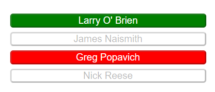
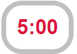

# Sports Quiz 

This is a quiz website for people who want are intrerested in sports and want to challenge themselves to a fun interactive quiz. The question come from a varity of sports like basketball, football, gymnastics, track and many more. It also has a timer and a score system to add more stakes and enjoyment in the website.

## Features

This section goes over the different parts of this project. An explanation will be given of what the features provide the user.

### Exisiting Features
- __Introduction__
  
  -This section is an small introduction to the quiz.

  -It describes:
  
  - what the quiz is about.

  - How long it should take to complete.

  - And who made it.

   

- __Questions__

  -This part produces the questions that have to be answered in the quiz.

  -It has a total of 10 questions.

  - __Images__

    -Each question has a image with it.

    -The image is there to help the user get a visual understanding of the question if the words alone cannot help.

 

  - __Answers__

    -This part is where the answers to the question given are.

    -The user is given 4 different answers, with only 1 of them being the right answer.

    -When a user clicks on a answer the text will either turn red or green.

    -If the text turns red that is a sign of an incorrect answer.

    -If the text turns Green that is a sign of an correct answer.

  - __Countdown__
  
    -The Countdown is used to give the user a challenge while taking the quiz.

    -The countdown automatically starts when the page is loaded.

    -When the time reaches zero, the quiz ends and the users score is shown, regardless if they have finished all 10 questions or not.

## Testing

 - I tested to see if the website would work on Google Chrome, Microsoft Edge and Firefox.

 - The website was able to function as intended and that the it was responsive.

 - The Questions all loaded in the correct position with the correct picture.

### Validator Testing

- HTML
  - No errors were found when passing through the offiacl [(Jigsaw) validator](https://validator.w3.org/).
  
- CSS
  - No errors were found when passing through the official [(Jigsaw) validator](https://jigsaw.w3.org/css-validator/validator).

- JavaScript
  - 